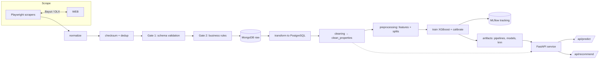

<div align="center">

# فير ماركت (FairMarket)

**اعرف سعر عقارك بكام في مصر.**


[**English**](README.md) · [**العربية**](README.ar.md)

</div>

---

فير ماركت منصة ذكاء اصطناعي شاملة لسوق العقارات المصري. بتجمع إعلانات حقيقية من السوق باستمرار، بتتحقق منها وتنضفها، وبتتعلّم النطاق السعري العادل لكل منطقة وكمبوند، وبتدي المعلومة دي لأي حد — مشترين وبايعين ومكاتب عقارات ومستثمرين — بدل ما يفضلوا يخمّنوا.

> [!NOTE]
> **متاخدش كلامنا — جرّب بنفسك.** اللي هنا مش فكرة ولا عرض بوربوينت. المنتج كله **اتبنى واتدرّب وشغال في هذا الريبو** — تطبيق ويب شغال، API حقيقي، موديلات مدربة، والسكربتات اللي بتجيب منها البيانات — كل حاجة موجودة وجاهزة تشغّلها.

| هتاخد إيه | ليه هي حاجة حقيقية |
| :--- | :---: |
| **سعر عادل لأي بيت في مصر** | تطبيق ويب شغال (عربي + إنجليزي) بتدخل بيانات العقار وبيرد عليك بنطاق سعري في ثواني |
| **إجابات من سوق النهاردة** | إعلانات حية من بيوت و OLX، بتتحدث **كل يوم** مع بداية السوق (بتوقيت القاهرة) |
| **دليل إنها شغالة** | موديلات أسعار مدربة، API شغال، وتطبيق تفتحه من المتصفح — كله في الريبو، مفيش حاجة مختفية |
| **ثقة في الأرقام** | كل تقييم بيتفحص مرتين، وبيتأكد من التكرار، وبيتم معايرته على أسعار عقارات مماثلة |
| **منتج مش بروتوتايب** | شهور من التطوير المستمر، CI بيفحص الكود، جاهز للتشغيل على السيرفرات |

> [!NOTE]
> **دقة بتكبر مع كل إعلان.** على عقارات ما شافهاش الموديل من قبل، فير ماركت بيشرح **~77% من الفروق في الأسعار** وبيجيب قريب من **~17% من السعر العادل** — والأرقام دي بتتحسن كل يوم. كل إعلان جديد بتدخله المنصة هو درس جديد: كل ما نتعلم أكتر، كل ما نبقى أذكى، وكل ما نسبة الخطأ تقل. الدليل موجود في سجلّات MLflow داخل الريبو.

> _التطبيق — أمر واحد وتشغّله. صورة التطبيق جاية قريب: `docs/screenshots/valuation.png`_

## المحتويات

- [المشكلة](#المشكلة)
- [إيه اللي بيعمله فير ماركت](#إيه-اللي-بيعمله-فير-ماركت)
- [لمين](#لمين)
- [القدرات الأساسية](#القدرات-الأساسية)
- [بيشتغل إزاي من الأول لآخر](#بيشتغل-إزاي-من-الأول-لآخر)
- [التقنيات](#التقنيات)
- [تطبيق الويب (الفرونت إند)](#تطبيق-الويب-الفرونت-إند)
- [هيكل المشروع](#هيكل-المشروع)
- [المتطلبات](#المتطلبات)
- [التثبيت](#التثبيت)
- [الإعدادات](#الإعدادات)
- [الاستخدام](#الاستخدام)
- [الاختبارات](#الاختبارات)
- [دوكر](#دوكر)
- [المخرجات](#المخرجات)
- [خريطة الطريق](#خريطة-الطريق)
- [تنويه](#تنويه)
- [ملاحظات](#ملاحظات)
- [الفريق](#الفريق)

## المشكلة

في مصر، تقييم العقار لعبة حظ. الإعلانات أسعارها مبالغ فيها، متفرقة على منصات كتير، ونادرًا ما تكون متسقة. المشتري بيدفع زيادة، والبايع بتبخس، والمكاتب بتخسر ثقة العملاء.

فير ماركت موجود عشان يحل محل التخمين بالبيانات: إشارات حية من السوق، متحقّق منها بدقة، بتحوّل لـ**تقدير سعر عادل** و**عقارات مماثلة موثوقة** — لأي حد.

## إيه اللي بيعمله فير ماركت

| لِمن | النتيجة |
| :--- | :---: |
| **المشترين** | يعرفوا النطاق السعري العادل قبل التفاوض — مش السعر المعلن، ده اللي المفروض يدفعوه فعلًا. |
| **البايعين** | يسعّروا بثقة بأدلة حقيقية من السوق وميضيّعوش فلوس. |
| **المكاتب** | يقدموا للعميل عقارات مماثلة متحقق منها وسياق السوق الحي في ثواني. |
| **المستثمرين والمحللين** | يتابعوا اتجاهات سعر المتر بالمنطقة والكمبوند من بيانات نظيفة وموثوقة. |

من جوه، بتجمع إعلانات حية (بيوت و OLX)، وبتعدي كل سجل على نظام تحقق من مرحلتين، وبتتحدث يوميًا — بحيث الأرقام تعبّر عن سوق النهاردة مش سوق السنة اللي فاتت.

## لمين

- **المشترين والبايعين** اللي محتاجين رأي تاني في أي إعلان.
- **مكاتب العقارات** اللي عايزين عقارات مماثلة متحققة في مكالمة واحدة.
- **مستثمري العقارات** اللي بيحللوا الأسعار العادلة على مستوى المناطق والكمبوندات.
- **فرق البيانات والتعلم الآلي** اللي محتاجين داتاسيت نظيف وقابل لإعادة الإنتاج لسوق العقارات المصري.

## القدرات الأساسية

- **سكربتات stealth** لبيوت و OLX باستخدام Playwright مع تكتيكات مضادة للبوتات.
- **تحقق من مرحلتين**: فحص مخططات Pydantic، ثم قواعد عمل — مع إزالة التكرار بالـ checksum قبل أي إدخال في قاعدة البيانات.
- **تحديث يومي** عبر جدولة Prefect (بتوقيت إفريقيا/القاهرة) مع تنبيهات تلجرام بالنجاح والفشل.
- **تقدير السعر العادل** باستخدام XGBoost في وضعين (`only_villas` / `no_villas`)، مع معايرة Isotonic لنطاقات سعرية موثوقة، وتقديرات لسعر المتر على مستوى المنطقة.
- **توصيات ذكية** (KNN) بتقترح عقارات مماثلة حوالين السعر العادل.
- **تحسين مستمر**: ضبط Hyperparameters عبر Optuna مع تتبع التجارب في MLflow.
- **API نظيف وموثّق** (`/predict`, `/recommend`, `/health`, `/locations`) جاهز يشغّل منتجات ولوحات عرض.
- **بنية إنتاجية**: Poetry و Docker و CI عبر GitHub Actions.

## بيشتغل إزاي من الأول لآخر

البيانات بتتدفق من الإعلانات الحية لتنفيذ تنبؤ في خط أنابيب واحد ومتابَع:



كل مرحلة منفصلة وقابلة للاختبار بشكل مستقل — موثوقة بالتصميم، مش بالصدفة.

## التقنيات

| الطبقة | التقنية |
| :--- | :--- |
| اللغة | Python 3.12 |
| التغليف | Poetry |
| جمع البيانات | Playwright + playwright-stealth |
| الجدولة | Prefect (v3), cron scheduling |
| التخزين | MongoDB (raw), PostgreSQL (modeled) |
| التحقق | Pydantic v2 |
| التعلم الآلي | scikit-learn, XGBoost |
| الضبط والتتبع | Optuna, MLflow |
| تقديم الخدمة | FastAPI, SQLAlchemy |
| التشغيل | Docker, Docker Compose, GitHub Actions |

## تطبيق الويب (الفرونت إند)

فير ماركت بيصدر مع تطبيق ويب Next.js جاهز للإنتاج في `frontend/` — الواجهة العامة للمنصة. المستخدم بيوصف العقار وبياخد نطاق سعري عادل فورًا، مع قايمة بعقارات مماثلة، بالعربي المصري أو الإنجليزي (بدعم كامل لـ RTL).

```text
سعر عادل في ثواني  ──▶  تطبيق ويب متوافق مع الموبايل  ──▶  عربي + إنجليزي (RTL)
```

الإعداد والتفاصيل في [`frontend/README.md`](frontend/README.md):

```bash
cd frontend
npm install
cp .env.example .env.local
npm run dev   # → http://localhost:3000
```

التطبيق جاهز للنشر على Vercel (مجلد الجذر `frontend`) ومغطى بجوب CI خاص بيه (lint, type-check, build, tests).

---

## للمطورين

باقي الملف بيتكلم عن تشغيل وتطوير ونشر فير ماركت بنفسك.

## هيكل المشروع

```text
├── scrapers/          # منطق الجمع الخاص بكل مصدر وملفات الإعداد JSON
├── data/
│   ├── ingestion/     # تسوية، إزالة تكرار، تحقق، وإدخال في MongoDB
│   ├── validation/    # فحص المخططات (Gate 1) وقواعد العمل (Gate 2)
│   └── processing/    # تحويل، تنظيف، تسوية، وما قبل المعالجة
├── pipeline/          # نقطة دخول تدفق Prefect ومشغّل المعالجة
├── models/            # تدريب، ضبط، تنبؤ، وبناء فهارس التوصيات
├── api/               # خدمة FastAPI (predict, recommend, health, locations)
├── utils/             # اتصالات قواعد البيانات وحل الأسرار (env / Prefect)
├── artifacts/         # خطوط الأنابيب والموديلات وفهارس التوصيات المحفوظة
├── frontend/          # تطبيق الويب Next.js (تقييم، نتائج، توصيات)
├── tests/             # اختبارات وحدات لكل طبقة
└── notebooks/         # دفاتر الاستكشاف والتحليل
```

## المتطلبات

- Python 3.12 أو أحدث
- Poetry
- قاعدة بيانات PostgreSQL
- كلاستر MongoDB Atlas (أو أي مصدر متوافق مع MongoDB)
- بيانات بوت تلجرام للإشعارات

## التثبيت

```bash
poetry install
poetry run playwright install
```

## الإعدادات

اعمل ملف `.env` من الملف النموذجي واملأ القيم بتاعتك:

```bash
cp .env.example .env
```

| المتغير | الوصف |
| :--- | :--- |
| `MONGO_URI` | رابط اتصال MongoDB المستخدم من السكربتات |
| `POSTGRES` | رابط اتصال PostgreSQL (رابط SQLAlchemy) |
| `TELEGRAM_BOT_TOKEN` | توكن البوت لإشعارات خط الأنابيب |
| `TELEGRAM_CHAT_ID` | الـ Chat ID اللي بيتبعت له الإشعارات |
| `CORS_ORIGINS` | اختياري: الأصول المسموح لها بالاتصال بالـ API مفصولة بفواصل |

لو متغير البيئة مش متظبط، المشروع بيرجع للـ Prefect Secret block المطابق.

## الاستخدام

### تشغيل خط الأنابيب بالكامل

```bash
poetry run python pipeline/main.py
```

هيتعمل الآتي:

1. تحميل ملفات تعريف السكربتات من `scrapers/configs/`.
2. جمع الإعلانات من كل مصدر.
3. إدخال السجلات الخام في MongoDB بعد التحقق وإزالة التكرار.
4. تحويل وتنظيف ومعالجة البيانات.
5. حفظ جداول التدريب والتحقق والاختبار في PostgreSQL.
6. حفظ خط معالجة ما قبل التدريب في `artifacts/pipelines/`.

### المعالجة فقط

لو عندك جدول `clean_properties` نظيف وعايز تعيد بناء الميزات والتقسيمات بس:

```bash
poetry run python pipeline/run_preprocessing.py
```

### تدريب وضبط الموديلات

درّب موديل أسعار لأي وضع:

```bash
poetry run python models/train.py --mode only_villas
poetry run python models/train.py --mode no_villas --weighting sqrt_inv
```

`--weighting` بيقبل `none`, `sqrt_inv`, أو `inv`.

شغّل البحث عن Hyperparameters بـ Optuna (متسجل في MLflow):

```bash
poetry run python models/tune.py
```

### التوصيات

ابنِ فهرس KNN لوضع، وبعدين اعمل توصية بعقارات مماثلة:

```bash
poetry run python models/recommend.py --build-index only_villas
poetry run python models/recommend.py --recommend 42 --mode no_villas --k 10
```

فلاتر إضافية: `--price-tolerance`, `--city`, `--district`, `--property-type`, `--price-min`, `--price-max`, و `--explore`.

### تشغيل الـ API

```bash
poetry run uvicorn api.main:app --reload
```

الوثائق التفاعلية متاحة على `http://localhost:8000/docs`.

```bash
# فحص الحالة
curl http://localhost:8000/health

# قايمة المناطق المعروفة
curl http://localhost:8000/api/locations

# توقع سعر عادل
curl -X POST http://localhost:8000/api/predict \
  -H "Content-Type: application/json" \
  -d '{
    "area": 180,
    "beds": 3,
    "baths": 3,
    "location": "New Cairo",
    "property_type": "Villa",
    "furnishing": "Unfurnished",
    "amenities": ["Playground", "Security"]
  }'

# توصية بعقارات مماثلة
curl -X POST http://localhost:8000/api/recommend \
  -H "Content-Type: application/json" \
  -d '{
    "area": 180,
    "beds": 3,
    "baths": 3,
    "location": "New Cairo",
    "property_type": "Villa",
    "furnishing": "Unfurnished",
    "price_min": 8000000,
    "price_max": 12000000,
    "k": 10
  }'
```

حقل `location` لازم يطابق قيمة من `/api/locations`.

نقطة النهاية `/api/predict` بترجع نطاق سعري عادل مع الموقع المُحَل:

```json
{
  "predicted_price": 10500000.0,
  "price_upper": 11550000.0,
  "price_lower": 9450000.0,
  "resolved_location": {
    "original": "New Cairo",
    "city": "Cairo",
    "district": "New Cairo",
    "compound": null,
    "matched": true
  }
}
```

## الاختبارات

```bash
poetry run pytest
```

التنسيق بيتفحص بـ Black، مطابقًا لخط CI:

```bash
poetry run black --check .
```

الاختبارات بتغطي قواعد التنظيف، منطق التحقق، أدوات التسوية، خط المعالجة، التنبؤ، وخدمات التوصية.

## دوكر

الريبو بيصدر إعداد حاويات لتشغيل خط الأنابيب:

```bash
docker compose -f Docker-compose.yaml up --build
```

للتشغيل المجدول، الـ Prefect deployment في `prefect.yaml` بيشغّل `pipeline/main.py:main` يوميًا الساعة 12:00 (إفريقيا/القاهرة) وتقدر تطبقه على work pool بتاعك.

## المخرجات

بعد تشغيل ناجح، المفروض تشوف:

- جداول منظفة ونموذجية في PostgreSQL (`clean_properties`، تقسيمات تدريب/تحقق/اختبار).
- خط معالجة محفوظ تحت `artifacts/pipelines/`.
- موديلات مدربة ومخرجات معايرة وتقديرات سعر المتر بالمنطقة تحت `artifacts/models/`.
- فهارس توصيات KNN تحت `artifacts/recommendations/`.
- رسائل حالة تلجرام للنجاح أو الفشل.

## خريطة الطريق

- **مصادر أكتر**: التوسع بعد بيوت و OLX لمنصات عقارية مصرية تانية.
- **تغطية أكتر**: دعم أوسع للمدن والكمبوندات مع نمو حجم البيانات.
- **موديلات أدق**: كل تحديث يومي بيدرب على بيانات أكتر، وبيقلل خطأ التقدير مع الوقت.
- **منتج أثرى**: اتجاهات أسعار تاريخية، تقارير لكل كمبوند، وأدوات مقارنة في تطبيق الويب.

## تنويه

فير ماركت بيقدم تقديرات أسعار مبنية على البيانات للإرشاد، مش تقييمات عقارية رسمية. الإعلانات المنشورة بتتجمع من مصادر خارجية، والتقديرات بجودة البيانات اللي تحتها. دايماً تأكد من قيمة العقار مع مختص محلي مؤهل قبل أي قرار مالي.

## ملاحظات

- المشروع مبني على شغل خط أنابيب حقيقي، فآمن طريقة للتطوير هي إضافة أو تعديل مرحلة واحدة في كل مرة.
- لو غيّرت المخططات أو قواعد التنظيف، حدّث الاختبارات المطابقة في `tests/` كمان.

## الفريق

- ولاء مجدي
- عبدالرحمن سيد
