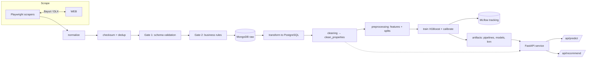

# FairMarket

### Know what your home is really worth in Egypt.

FairMarket is an end-to-end machine learning platform for the Egyptian real-estate market. It continuously collects live listings, verifies and cleans them, learns fair price ranges for every district, and exposes that intelligence through a simple API — so buyers, sellers, agents, and investors can stop guessing.


---

## The Problem

In Egypt, pricing a property is a guessing game. Listings are inflated, scattered across platforms, and rarely consistent. Buyers overpay, sellers underprice, and agents lose trust with their clients.

FairMarket exists to replace guesswork with data: live market signals, rigorously validated, turned into a **fair price estimate** and **credible comparables** — for anyone.

## What FairMarket Does

| For | Outcome |
| --- | --- |
| **Buyers** | Know a property's fair price range before negotiating — not the listed price, but what it should cost. |
| **Sellers** | Price confidently with data-backed evidence and avoid leaving money on the table. |
| **Agents** | Present clients with verified comps and live market context, instantly. |
| **Investors & analysts** | Track price-per-square-meter trends by district and compound from clean, trusted data. |

Under the hood it scrapes live listings (Bayut & OLX), passes every record through a two-gate validation system, and refreshes daily — so the numbers reflect today's market, not last year's.

## Who It's For

- **Buyers & sellers** looking for a second opinion on any listing.
- **Real-estate agents** who want verified comparables in one call.
- **Property investors** analyzing fair prices across districts and compounds.
- **Data & ML teams** who need a clean, reproducible real-estate dataset for the Egyptian market.

## Key Capabilities

- **Stealth scrapers** for Bayut and OLX using Playwright with anti-bot evasion.
- **Two-gate validation**: Pydantic schema checks, then business rules — with checksum-based deduplication before anything reaches the database.
- **Daily refresh** through Prefect orchestration (scheduled, Africa/Cairo) with Telegram success/failure alerts.
- **Fair price estimation** with XGBoost in two modes (`only_villas` / `no_villas`), isotonic calibration for trustworthy price ranges, and district-level price-per-square-meter estimates.
- **Smart recommendations** (KNN) that surface similar properties around a fair price.
- **Continuous improvement**: Optuna hyperparameter tuning with MLflow experiment tracking.
- **A clean, documented API** (`/predict`, `/recommend`, `/health`, `/locations`) ready to power products and dashboards.
- **Production plumbing**: Poetry, Docker, and CI via GitHub Actions.

## How It Works, End to End

Data flows from live listings to a served prediction in a single, monitored pipeline:



Each stage is modular and independently testable — reliable by design, not by accident.

## Tech Stack

| Layer | Technology |
| --- | --- |
| Language | Python 3.11+ |
| Packaging | Poetry |
| Scraping | Playwright + playwright-stealth |
| Orchestration | Prefect (v3), cron scheduling |
| Storage | MongoDB (raw), PostgreSQL (modeled) |
| Validation | Pydantic v2 |
| ML | scikit-learn, XGBoost |
| Tuning & tracking | Optuna, MLflow |
| Serving | FastAPI, SQLAlchemy |
| Ops | Docker, Docker Compose, GitHub Actions |

---

# For Developers

The rest of this document covers running, extending, and deploying FairMarket yourself.

## Project Layout

```text
├── scrapers/          # Source-specific scraping logic and JSON configs
├── data/
│   ├── ingestion/     # Normalize, dedupe, validate, insert into MongoDB
│   ├── validation/    # Schema checks (Gate 1) and business rules (Gate 2)
│   └── processing/    # Transformation, cleaning, normalization, preprocessing
├── pipeline/          # Prefect flow entrypoint and preprocessing runner
├── models/            # Train, tune, predict, and build recommendation indexes
├── api/               # FastAPI service (predict, recommend, health, locations)
├── utils/             # DB connections and secret resolution (env / Prefect)
├── artifacts/         # Persisted pipelines, models, and recommendation indexes
├── tests/             # Unit tests for every layer
└── notebooks/         # Exploration and analysis notebooks
```

## Prerequisites

- Python 3.11 or newer
- Poetry
- A PostgreSQL database
- A MongoDB Atlas cluster (or another MongoDB-compatible source)
- Telegram bot credentials for notifications

## Installation

```bash
poetry install
poetry run playwright install
```

## Configuration

Create a `.env` file from the example file and fill in your values:

```bash
cp .env.example .env
```

| Variable | Description |
| --- | --- |
| `MONGO_URI` | MongoDB connection string used by the scrapers |
| `POSTGRES` | PostgreSQL connection string (SQLAlchemy URL) |
| `TELEGRAM_BOT_TOKEN` | Bot token for pipeline notifications |
| `TELEGRAM_CHAT_ID` | Chat ID the notifications are sent to |
| `CORS_ORIGINS` | Optional comma-separated origins allowed to call the API |

If an environment variable is not set, the project falls back to the matching Prefect Secret block.

## Usage

### Run the full pipeline

```bash
poetry run python pipeline/main.py
```

This will:

1. Load scraper profiles from `scrapers/configs/`.
2. Scrape listings from each source.
3. Ingest raw records into MongoDB after validation and dedup.
4. Transform, clean, and preprocess the data.
5. Save train, validation, and test tables to PostgreSQL.
6. Persist the preprocessing pipeline to `artifacts/pipelines/`.

### Preprocessing only

If you already have a cleaned `clean_properties` table and only want to rebuild features and splits:

```bash
poetry run python pipeline/run_preprocessing.py
```

### Train and tune models

Train a price model for either mode:

```bash
poetry run python models/train.py --mode only_villas
poetry run python models/train.py --mode no_villas --weighting sqrt_inv
```

`--weighting` accepts `none`, `sqrt_inv`, or `inv`.

Run Optuna hyperparameter search (logged via MLflow):

```bash
poetry run python models/tune.py
```

### Recommendations

Build a KNN index for a mode, then recommend similar properties:

```bash
poetry run python models/recommend.py --build-index only_villas
poetry run python models/recommend.py --recommend 42 --mode no_villas --k 10
```

Additional filters: `--price-tolerance`, `--city`, `--district`, `--property-type`, `--price-min`, `--price-max`, and `--explore`.

### Run the API

```bash
poetry run uvicorn api.main:app --reload
```

Interactive docs are available at `http://localhost:8000/docs`.

```bash
# Health check
curl http://localhost:8000/health

# List known locations
curl http://localhost:8000/api/locations

# Predict a fair price
curl -X POST http://localhost:8000/api/predict \
  -H "Content-Type: application/json" \
  -d '{
    "area": 180,
    "beds": 3,
    "baths": 3,
    "location": "New Cairo",
    "property_type": "Villa",
    "furnishing": "Unfurnished",
    "amenities": ["Playground", "Security"]
  }'

# Recommend similar properties
curl -X POST http://localhost:8000/api/recommend \
  -H "Content-Type: application/json" \
  -d '{
    "area": 180,
    "beds": 3,
    "baths": 3,
    "location": "New Cairo",
    "property_type": "Villa",
    "furnishing": "Unfurnished",
    "price_min": 8000000,
    "price_max": 12000000,
    "k": 10
  }'
```

The `location` field must match a value from `/api/locations`.

## Testing

```bash
poetry run pytest
```

Formatting is checked with Black, matching the CI pipeline:

```bash
poetry run black --check .
```

The tests cover the cleaning rules, validation logic, normalization helpers, preprocessing pipeline, prediction, and recommendation services.

## Docker

The repository ships a container setup for running the pipeline:

```bash
docker compose -f Docker-compose.yaml up --build
```

For a scheduled deployment, the Prefect deployment in `prefect.yaml` runs `pipeline/main.py:main` daily at 12:00 (Africa/Cairo) and can be applied against your own work pool.

## Outputs

After a successful run you should expect:

- Cleaned and modeled tables in PostgreSQL (`clean_properties`, train/val/test splits).
- A persisted preprocessing pipeline under `artifacts/pipelines/`.
- Trained models, calibration artifacts, and district price-per-square-meter estimates under `artifacts/models/`.
- KNN recommendation indexes under `artifacts/recommendations/`.
- Telegram status messages for success or failure.

## Notes

- The project is structured around real pipeline work, so the safest way to extend it is to add or update one stage at a time.
- If you change the schema or cleaning rules, update the matching tests in `tests/` as well.

## Authors

- Walaa Magdy
- Abdelrahman Sayed
